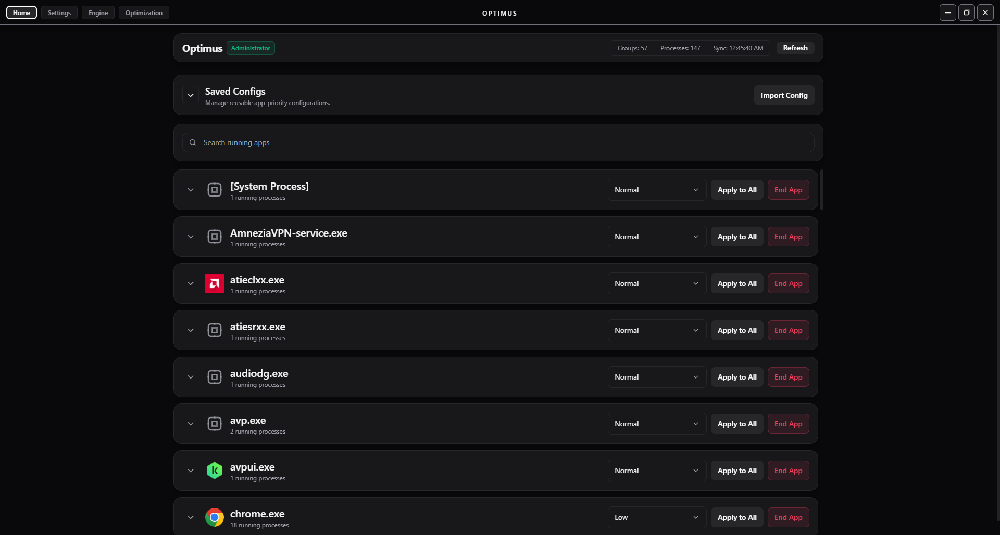
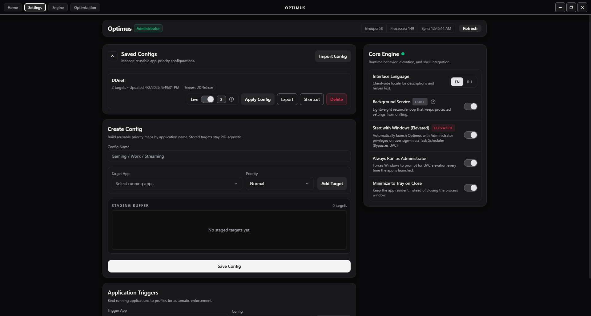

<div align="center">
  <h1>Optimus</h1>
    
    
    
    
  
</div>

<br>

**Optimus** is a zero-overhead, brutal process priority manager for Windows. It doesn't just blindly force priorities — it uses a context-aware engine to inject priorities exactly when needed, and sleeps when you alt-tab. Built with a lightning-fast Rust core and a modern React frontend.

## Screenshots

<p align="center">
  
  
</p> 

## Features

- **Sniper Mode Watchdog**: The Rust background loop doesn't scan the whole OS. It targets only the processes in your active config, dropping CPU usage to ~0.01%.
- **UI Cryo-Sleep**: When minimized to the system tray, the React frontend completely halts process polling. Zero rendering, zero IPC overhead.
- **Smart / Always Modes**: Set a priority permanently (*Always*), or link it to a specific game/app (*Smart*). Optimus releases the priority lock the second you close the game.
- **Delta IPC Polling**: Icons are hashed using `blake3` (absolute path + size). The backend only sends missing icons to the UI, reducing Bridge payloads by 99%.
- **Atomic Configs**: Configurations are saved using temporary files and atomic `ReplaceFileW` operations. No corrupted JSONs during power outages.
- **System Tray Integration**: True background ninja. Minimize to tray with quick-action context menus (e.g., "Purge Memory").

## Dependencies

Optimus is built on a decoupled architecture (Tauri v2):
- **Core**: `Rust` (Handles WinAPI, Watchdog, Memory Purging, UAC Elevation).
- **Frontend**: `React` + `TypeScript` + `TailwindCSS` (Glass-morphism UI, strictly memoized).
- **Hashing**: `blake3` (Cryptographically secure deterministic icon hashing).
- **Bridge**: `Tauri IPC` (Optimized asynchronous message passing).

## Installation

1. Download the latest `.exe` or `.msi` from [GitHub Releases](https://github.com/PetruchiO/optimus/releases).
2. Run the installer.
3. Launch **Optimus** (Optionally run as Administrator for system-level process control).

## Usage

1. Open Optimus and locate your target game/application in the list.
2. Select a priority (e.g., `High`).
3. Choose the enforcement mode:
   - **Always**: Forces priority 24/7.
   - **Smart**: Select a "Trigger App". The priority is only enforced while the trigger app is running.
4. Minimize the app. It will retreat to the System Tray and manage your PC in the background.

## Compiling from Source

1. Clone the repository:
   ```bash
   git clone [https://github.com/PetruchiO/optimus.git](https://github.com/PetruchiO/optimus.git)
   ```
2. Navigate to the project directory:
   ```bash
   cd optimus
   ```
3. Install Node dependencies:
   ```bash
   npm install
   ```
4. Run in Development mode:
   ```bash
   npm run tauri dev
   ```
5. Build the optimized Release binary (`opt-level = "z"`, `lto = true`):
   ```bash
   npm run tauri build
   ```

## Contributing

Contributions, issues, and feature requests are welcome! 
1. Fork the project.
2. Create your feature branch (`git checkout -b feature/AmazingFeature`).
3. Commit your changes (`git commit -m 'Add some AmazingFeature'`).
4. Push to the branch (`git push origin feature/AmazingFeature`).
5. Open a Pull Request.

## Credits
- **Creator & Lead Developer**: Egor (PetruchiO)
- **License**: Distributed under the MIT License. See `LICENSE` for more information.
